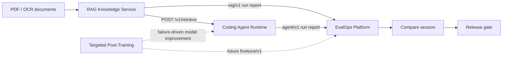

# Agent Systems Portfolio

A cohesive AI engineering portfolio built around one production-style loop:
an Agent Runtime uses a document knowledge service, while a shared EvalOps
platform records runs, compares candidates, and makes release decisions.

The workspace contains three integrated core systems plus one post-training
extension. Each project remains an independent Git repository and Python
environment, pinned by this parent repository as a Git submodule. This root
provides the shared architecture, operating rules, and verification entry
points.

## System Overview



## Projects

| Project | Role | Current state |
|---|---|---|
| [`llm-coding-agent-system`](./llm-coding-agent-system/) | Persistent Agent Runtime, tool execution, verification, resume/retry, knowledge tool | Integrated; 275 tests passing |
| [`rag-benchmark-system`](./rag-benchmark-system/) | PDF/OCR ingestion, BM25/FAISS retrieval API, citation/NLI evaluation | Integrated; 415 tests passing, 1 optional skip |
| [`llm-evalops-platform`](./llm-evalops-platform/) | Versioned ingest, normalization worker, run comparison, release gate | Integrated; 45 tests passing |
| [`coding-llm-finetune`](./coding-llm-finetune/) | Failure-driven SFT/DPO pipeline and clean evaluation | Extension; pipeline prepared, training pending |

## Quick Verification

Run all three integrated project test suites:

```bash
make test
```

Run the post-training extension's offline CLI smoke checks:

```bash
make finetune-smoke
```

Run the real local HTTP closure—generated PDF → RAG ingestion → Agent
retrieval → Agent/RAG reports → EvalOps compare/gate:

```bash
make closure
```

No LLM key, cloud service, external model, or production index is required for
the closure test. Its latest machine-readable result is stored at
[`artifacts/closure/three-project-closure-latest.json`](./artifacts/closure/three-project-closure-latest.json).

## Local Development

Clone the complete portfolio and its four pinned repositories with:

```bash
git clone --recurse-submodules https://github.com/MichLitt/agent-systems-portfolio.git
cd agent-systems-portfolio
make refresh
```

For an existing clone, initialize or update all project checkouts with
`git submodule update --init --recursive`.

Each project owns its dependencies:

```bash
cd llm-evalops-platform && uv sync
cd ../rag-benchmark-system && uv sync
cd ../llm-coding-agent-system && uv sync
```

To run the integrated services manually:

```bash
# Terminal 1: EvalOps API
cd llm-evalops-platform
uv run python scripts/start_api.py

# Terminal 2: EvalOps normalization worker
cd llm-evalops-platform
uv run python scripts/start_worker.py

# Terminal 3: RAG retrieval service
cd rag-benchmark-system
uv run python scripts/start_api.py --data-dir data/indexes --port 8080

# Terminal 4: Agent with both integrations
cd llm-coding-agent-system
export RAG_API_URL=http://localhost:8080
export EVALOPS_ENDPOINT=http://localhost:8000/v1/ingest/agent/v1
uv run python -m coder_agent
```

RAG evaluation processes use their own producer endpoint:

```bash
export EVALOPS_ENDPOINT=http://localhost:8000/v1/ingest/rag/v1
```

## Documentation

- [`AGENTS.md`](./AGENTS.md) — canonical instructions for coding agents working anywhere in this workspace.
- [`docs/engineering/ENGINEERING_GUIDE.md`](./docs/engineering/ENGINEERING_GUIDE.md) — architecture, contracts, workflows, and release gates.
- [`docs/roadmap/portfolio-roadmap.md`](./docs/roadmap/portfolio-roadmap.md) — portfolio strategy and longer-term roadmap.
- [`docs/plans/three-project-closure-plan.md`](./docs/plans/three-project-closure-plan.md) — implemented integration plan and acceptance evidence.
- [`docs/README.md`](./docs/README.md) — complete documentation index.

## Workspace Layout

```text
.
├── AGENTS.md
├── README.md
├── Makefile
├── docs/
│   ├── engineering/
│   ├── roadmap/
│   ├── plans/
│   └── career/
├── artifacts/closure/
├── scripts/
├── llm-coding-agent-system/
├── rag-benchmark-system/
├── llm-evalops-platform/
└── coding-llm-finetune/
```

The recommended workspace directory name is `agent-systems-portfolio`.
After moving the directory, run `make refresh` once to rebuild absolute paths
inside the four project environments.
